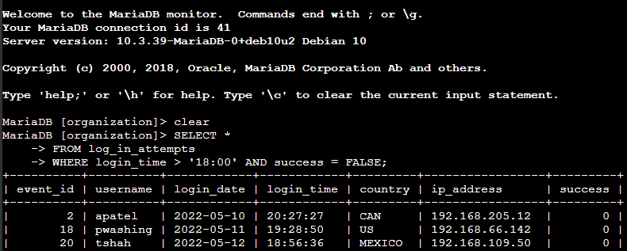

# Apply Filters to SQL Queries

## Project Description
In this project, I used SQL queries with filters to investigate cybersecurity issues within an organization. I analyzed suspicious login attempts, such as those made outside business hours, on specific dates, and from unauthorized locations. Additionally, I identified employees from specific departments (Marketing, Sales, Finance) and excluded those who had already received security updates (IT). The queries were performed on the `log_in_attempts` and `employees` tables, using operators like `AND`, `OR`, `NOT`, and `LIKE` to filter data efficiently.

---

## Retrieve After Hours Failed Login Attempts
To identify failed login attempts that occurred after business hours (18:00), I used the `AND` operator to combine two conditions: login time after 18:00 and success status equal to `FALSE`. The query returned all records of login attempts that meet these criteria.

**SQL Query:**
```sql
SELECT *
FROM log_in_attempts
WHERE login_time > '18:00' AND success = FALSE;
```

**Explanation:**
- `login_time > '18:00'`: Filters login attempts after 18:00.
- `success = FALSE`: Filters only failed login attempts.

Screenshot:


---

## Retrieve Login Attempts on Specific Dates
To investigate a suspicious event that occurred on `2022-05-09` and the day before (`2022-05-08`), I used the `OR` operator to retrieve login attempts on these two dates. The query returned all records of login attempts that occurred on those days.

**SQL Query:**
```sql
SELECT *
FROM log_in_attempts
WHERE login_date = '2022-05-09' OR login_date = '2022-05-08';
```

**Explanation:**
- `login_date = '2022-05-09'`: Filters login attempts on 05/09/2022.
- `login_date = '2022-05-08'`: Filters login attempts on 05/08/2022.

---

## Retrieve Login Attempts Outside of Mexico
To identify login attempts that did not originate from Mexico, I used the `NOT` operator and the pattern `LIKE 'MEX%'` to exclude records with values like `MEX` or `MEXICO` in the `country` column. The query returned all login attempts from other countries.

**SQL Query:**
```sql
SELECT *
FROM log_in_attempts
WHERE NOT country LIKE 'MEX%';
```

**Explanation:**
- `NOT country LIKE 'MEX%'`: Excludes login attempts where `country` starts with "MEX".

---

## Retrieve Employees in Marketing
To obtain information about employees in the Marketing department who work in the East building, I used the `AND` operator to combine two conditions: department equal to `Marketing` and office starting with `East`. The query returned all employees who meet these criteria.

**SQL Query:**
```sql
SELECT *
FROM employees
WHERE department = 'Marketing' AND office LIKE 'East%';
```

**Explanation:**
- `department = 'Marketing'`: Filters employees in the Marketing department.
- `office LIKE 'East%'`: Filters employees whose office starts with "East".

---

## Retrieve Employees in Finance or Sales
To identify employees in the Finance or Sales departments, I used the `OR` operator to include records from both departments. The query returned all employees working in Finance or Sales.

**SQL Query:**
```sql
SELECT *
FROM employees
WHERE department = 'Finance' OR department = 'Sales';
```

**Explanation:**
- `department = 'Finance'`: Filters employees in the Finance department.
- `department = 'Sales'`: Filters employees in the Sales department.

---

## Retrieve All Employees Not in IT
To identify employees who are not in the Information Technology (IT) department, I used the `NOT` operator to exclude records with `department` equal to `Information Technology`. The query returned all employees not in the IT department.

**SQL Query:**
```sql
SELECT *
FROM employees
WHERE NOT department = 'Information Technology';
```

**Explanation:**
- `NOT department = 'Information Technology'`: Excludes employees in the IT department.

---

## Summary
In this project, I used SQL queries with filters to investigate cybersecurity issues and identify specific employees for system updates. Through operators like `AND`, `OR`, `NOT`, and `LIKE`, I was able to filter suspicious login attempts (outside business hours, on specific dates, and from unauthorized locations) and identify employees from specific departments (Marketing, Sales, Finance) who require updates. The queries were efficient and returned the necessary data for security decision-making.
